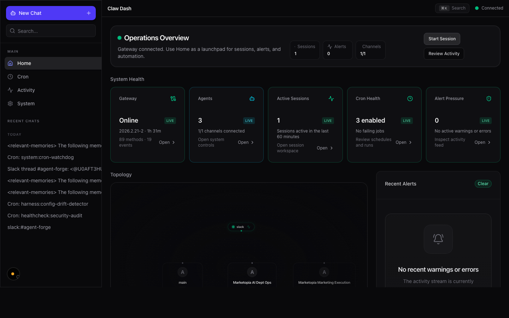
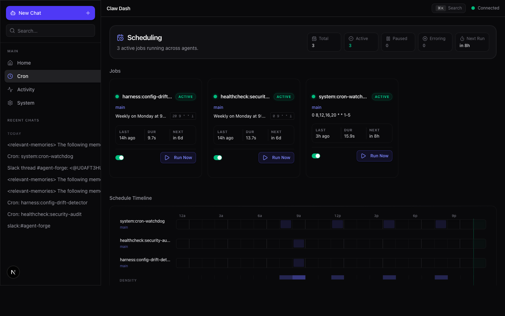
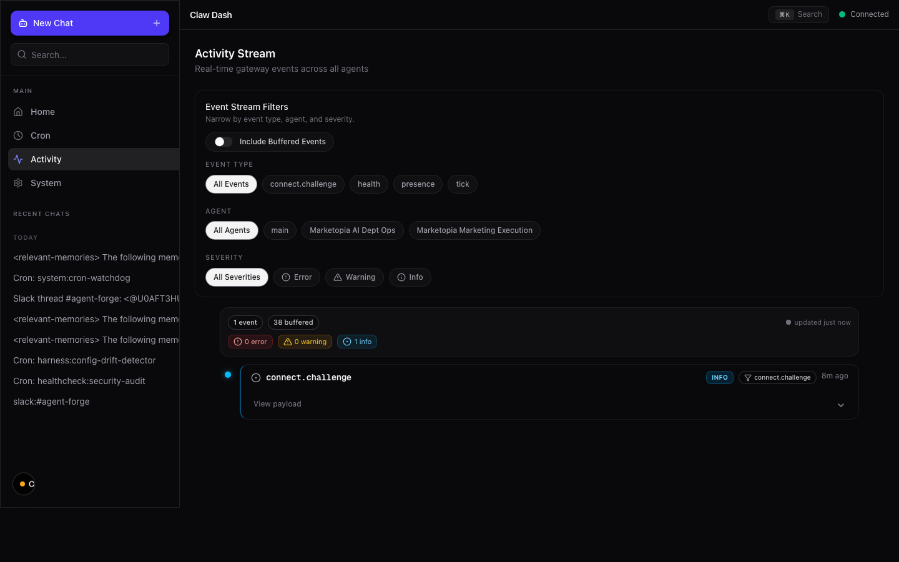
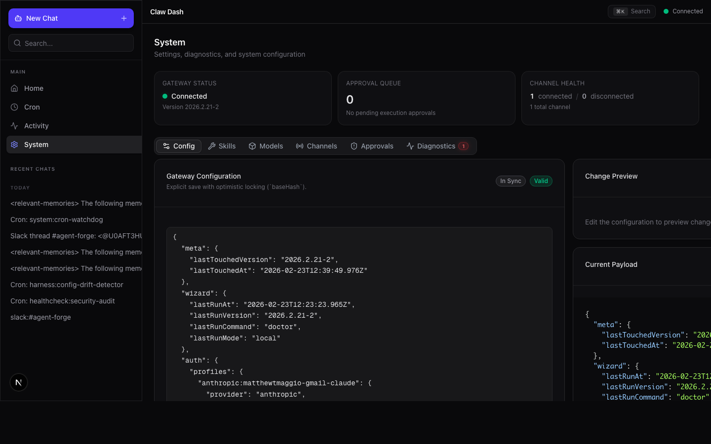
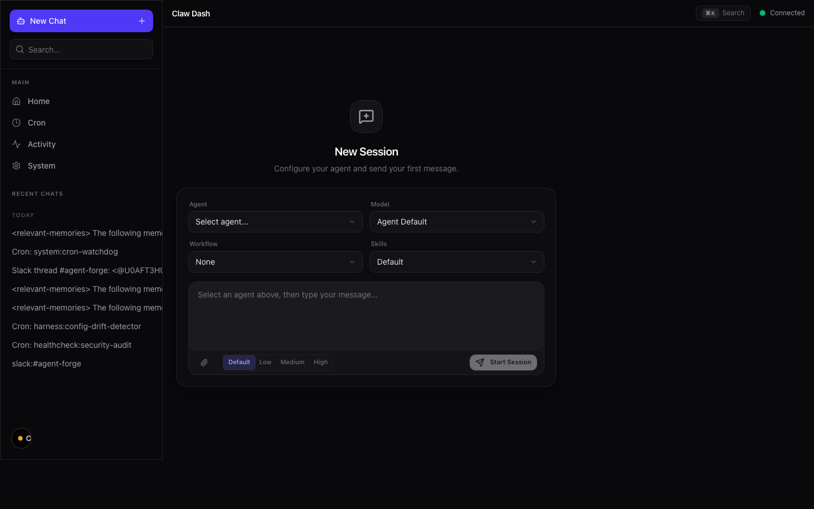

# Claw Dash

The real-time control plane for [OpenClaw](https://github.com/openclaw). Monitor, manage, and configure your AI agents and gateway from a single dashboard.




## Features

- **Live Dashboard** — Health cards, topology graph, active sessions, and recent alerts at a glance
- **Session Workspace** — Real-time chat transcript, composer, config, insights, and orchestration panels
- **Agent Management** — View and control all registered agents
- **Cron Scheduling** — Job status grid, schedule timeline, and run history with one-click execution
- **Activity Stream** — Filterable event feed with severity classification and freshness tracking
- **System Console** — Config editor, model browser, channel inspector, skills, exec approvals, and diagnostics
- **Command Palette** — Quick actions via `Cmd+K`

<details>
<summary>Screenshots</summary>

| Page | Screenshot |
|------|-----------|
| Cron Scheduling |  |
| Activity Stream |  |
| System Console |  |
| Session Workspace |  |

</details>

## Quick Start

### Prerequisites

- **Node.js** v20+
- **OpenClaw gateway** running locally (default `ws://127.0.0.1:18789`)

### Setup

```bash
git clone https://github.com/openclaw/claw-dash.git
cd claw-dash
npm install
cp .env.example .env.local
npm run dev
```

Open [http://localhost:3939](http://localhost:3939) in your browser.

### Environment Variables

| Variable | Default | Description |
|----------|---------|-------------|
| `OPENCLAW_GATEWAY_URL` | `ws://127.0.0.1:18789` | WebSocket URL of the OpenClaw gateway |
| `OPENCLAW_GATEWAY_TOKEN` | *(auto-resolved)* | Auth token. Falls back to `GATEWAY_AUTH_TOKEN` in `~/.openclaw/.env` |
| `CLAW_DASH_PORT` | `3939` | Port for the Claw Dash server |

## Commands

| Command | Description |
|---------|-------------|
| `npm run dev` | Start dev server on `:3939` |
| `npm run build` | Create optimized production build |
| `npm run start` | Run production server |
| `npm run lint` | Run ESLint |
| `npm run test` | Run Vitest test suite |
| `npm run probe` | Test gateway connectivity (WebSocket handshake + RPC) |

## Architecture

```
OpenClaw Gateway (WebSocket)
        |
        v
  GatewayClient --> EventCollector (in-memory ring buffer)
        |          --> ChatStreamBroker (SSE for live chat)
        v
  tRPC Routers (agents, sessions, cron, system)
        |
        v
  Next.js App Router + React Components
```

Claw Dash runs a **custom HTTP server** (`server.ts`) that initializes the gateway connection, event collector, and chat-stream broker before Next.js starts accepting requests. All gateway communication flows through a singleton `GatewayClient` attached to `globalThis` to survive hot reloads.

### Tech Stack

| Layer | Technology |
|-------|-----------|
| Framework | Next.js 16 (App Router) |
| UI | React 19, Tailwind CSS v4, shadcn/ui, Radix UI |
| Data | tRPC v11, TanStack React Query v5 |
| Graphs | React Flow (`@xyflow/react`) |
| Validation | Zod v4 |
| Testing | Vitest |
| Gateway | WebSocket (`ws`) — OpenClaw Protocol v3 |

## Project Structure

```
src/
├── app/          # Pages, layouts, API routes (App Router)
├── components/   # UI components grouped by domain
│   ├── ui/       # Shared primitives (shadcn-based)
│   ├── sessions/ # Session workspace
│   ├── topology/ # System topology graph
│   ├── system/   # System console
│   ├── activity/ # Activity stream
│   ├── home/     # Dashboard home widgets
│   ├── cron/     # Cron scheduling
│   └── layout/   # Sidebar, topbar
├── hooks/        # Custom React hooks
├── lib/          # Core logic (gateway client, tRPC, utilities)
├── server/       # tRPC router definitions
└── types/        # Shared TypeScript types
```

## Documentation

- [Architecture](docs/architecture.md) — Data flow, gateway protocol, event system, tRPC layer, UI patterns
- [Deployment](docs/deployment.md) — Production builds, PM2, systemd, nginx, Docker
- [Troubleshooting](docs/troubleshooting.md) — Gateway connectivity, common errors, debugging tips, FAQ

## Contributing

See [CONTRIBUTING.md](CONTRIBUTING.md) for development setup, coding conventions, and pull request guidelines.

## License

[MIT](LICENSE)
